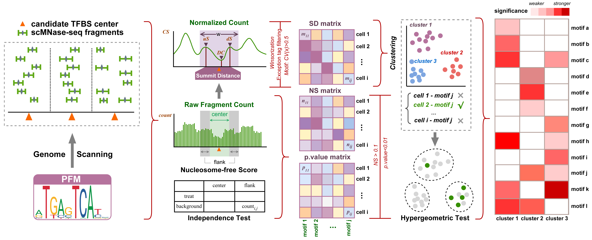

# scNucMap: mapping the nucleosome landscapes at single-cell resolution

**scNucMap** is a tool specifically designed to leverage the unique characteristics of scMNase-seq data to map the valley-like landscape of candidate nucleosome-free regions (NFRs). scNucMap demonstrates superior performance and robustness in clustering cells across diverse sample compositions and varying data complexities. It effectively identifies key transcription factors (TFs) associated with nucleosome depletion at cis-regulatory elements (CREs) at both the single-cell and cell-cluster levels, thereby facilitating cell type annotation and regulatory network inference.




## Citation  [](https://doi.org/10.1093/bioinformatics/btaf324)

Xiang Q, Lai B. scNucMap: mapping the nucleosome landscapes at single-cell resolution. Bioinformatics. 2025 Jun 2;41(6):btaf324.
## Requirements

- R 4.3.0 (or higher)
- Python 3.11.0 (or higher)
- C++17 standard compliant compiler
- [MOODS](https://github.com/jhkorhonen/MOODS) should be installed and added to the PATH

### Required R Packages

- optparse (1.7.5)
- pheatmap (1.0.12)
- umap (0.2.10.0)
- ggplot2 (3.5.1)
- Seurat (5.1.0)
- Signac (1.14.0)
- dplyr (1.1.4)

### Required Python Packages

- pandas (2.0.3)
- pybedtools (0.10.0)
- pyjaspar (2.1.1)

## Installation

To install this project, follow these steps:

1. Clone the repository:

    ```bash
    git clone https://github.com/qianming-bioinfo/scNucMap.git
    ```
2. Navigate to the project directory:

    ```bash
    cd scNucMap
    ```
3. Build and install the dependencies:

    ```bash
    make
    ```
4. Add `scNucMap` to the PATH:

    ```bash
    export PATH=$PATH:path/to/scNucMap/scripts
    ```

## Demo

scMNase-seq sequencing data can be downloaded from [Google Drive](https://drive.google.com/drive/folders/1FXsEcw1o_ZOIE5QhPzxA1M9xoh7e3gaO?usp=sharing).

For testing convenience, intermediate results are provided in the `data` directory.

```bash
cd path/to/scNucMap
```

### 1. Obtain potential TFBSs (optional: demo TFBSs are provided below):

- We have generated `data/mark_TF_singleCell_demo/motif_union_DHS_ovlpCenter` by replacing `data/test_chr_fasta` with a directory containing all mm9 chromosome FASTA files for a quick review.

```bash
tar -xzvf data/test_chr_fasta.tar.gz -C data
tar -xzvf data/nonRedundant_hs_mm_pfm.tar.gz -C data
```

```bash
obtain_TFBS -g data/test_chr_fasta \
            -m data/nonRedundant_hs_mm_pfm \
            -r data/union_ENCODE_DHS.rmbk.w200.txt \
            -o test_out/obtain_TFBS_res
```
- `-g`: Directory containing individual chromosome fasta files.
- `-m`: Directory containing PFM files.
- `-r`: Sorted open chromatin region in BED format.
- `-o`: Output directory.
- `--moods-args`: Additional arguments for `moods-dna.py` (optional), enclosed in quotes. The p-value is set to 5e-5 in scNucMap.
- `-h`: Show help message.

📤 **Output:**  
- A directory containing the potential TFBS centers for each motif.

### 2. Calculate summit distance and nucleosomal fragment count matrix (optional: skip to Step 3 if using pre-generated results):

💡 **Tips:** 
- For convenience in testing, we have generated `data/demo.summitDist.txt`, which corresponds to the summit distance matrix generated from test data, ready for direct use in the next step. 
- You can use `utilities/motif_ID_name_matching.py` to query the corresponding motif name based on the motif ID.
- A meta file can be generated using `utilities/make_meta_file.sh`.

```bash
cd utilities
sh make_meta_file.sh -h
```

```bash
tar -xzvf data/mark_TF_singleCell_demo.tar.gz -C data
```

```bash
cal_SD_mat_and_nucl_count -f data/meta_example.txt \
                          -c data/mark_TF_singleCell_demo/motif_union_DHS_ovlpCenter \
                          -o test_out/example_prefix
```
- `-f`: A meta file with the first column containing single-cell BED file paths, and the second column containing labels.
- `-c`: Directory of TFBS centers (first column: chromosome, second column: center position, third column: strand, optional).
- `-o`: Output prefix.
- `-u`: Center upstream, default: 400.
- `-d`: Center downstream, default: 400.
- `-w`: Window size, default: 1.
- `-m`: Motif shift size, default: 200.
- `-t`: Coverage threshold, default: 0.05.
- `-n`: Region hit threshold, default: 1.
- `-r`: Center range (upstream + downstream) in fragment count (default: 100).
- `-k`: Flank range (upstream + downstream) in fragment count (default: 200).
- `-p`: Number of threads. Use 1 for single-threaded, or a value >=1 for multi-threaded. Default: 1.
- `-M`: Mode (`standard` or `lite`, default: `standard`). `standard` runs faster but uses more memory; `lite` is slower but more memory-efficient.
- `-h`: Show help message.


📤 **Output:** 
- A summit distance matrix, where rows represent cells and columns represent motifs.
- Two nucleosomal fragment count matrices end with `centerNuclCountSum.txt` and `flankNuclCountSum.txt`

### 3. Clustering single cell samples:

```bash
cell_clustering -n data/motifID_and_name.txt \
                -m data/demo.summitDist.txt \
                -o test_out/cell_clustering_res
```
- `-n`: A two-column table listing the correspondence between motif IDs and names.
- `-m`: Path of summit distance matrix.
- `-o`: Output directory.
- `-c`: Threshold for cells with zero values (percentage) [default: 70].
- `-t`: Threshold for TFs with zero values (percentage) [default: 90].
- `-l`: Lower quantile for Winsorization [default: 0].
- `-u`: Upper quantile for Winsorization [default: 0.95].
- `-v`: Threshold for Coefficient of Variation (CV) [default: 0.5].
- `-d`: Option 'dims' in function Signac::RunSVD [default: 20].
- `-a`: Lower limit of option 'dims' in function Seurat::FindNeighbors [default: 2].
- `-b`: Upper limit of option 'dims' in function Seurat::FindNeighbors [default: 17].
- `-r`: Value of the Resolution option in the Seurat::FindClusters function [default: 0.6]
- `-p`: Clustering method: 1 for graph-based, 2 for tree-based [default: 1].
- `-k`: Number of clusters for tree-based clustering (must be provided if `-p` is 2).
- `-h`: Show help message.

📤 **Outputs:**  
- A plot showing motif selection based on the coefficient of variation (CV).
- A UMAP plot.
- A `sample_clusters.txt` file containing the sample clustering results.

### 4. Identify remarkable TFs:

First, calculate the background nucleosomal fragment count matrix:

```bash
tar -xzvf data/bg_region.tar.gz -C data
```

💡 **Tip:** 
- A meta file can be generated using `utilities/make_meta_file.sh`.

```bash
count_bg_nucl_frag -f data/meta_example.txt \
                   -c data/bg_region \
                   -o test_out/example_prefix_bg
```
- `-f`: A meta file with the first column containing scMNase-seq BED file paths, and the second column containing labels.
- `-c`: Directory of background TFBS centers (first column: chromosome, second column: center position, third column: strand, optional). Here can be `data/bg_region`.
- `-o`: Output prefix.
- `-u`: Center upstream (default: 100).
- `-d`: Center downstream (default: 100).
- `-l`: Flank upstream (default: 200).
- `-r`: Flank downstream (default: 200).
- `-w`: Window size (default: 1).
- `-h`: Show help message.

📤 **Output:** 
- Two nucleosomal fragment count matrices end with `centerNuclCountSum.txt` and `flankNuclCountSum.txt`

#### Remarkable TFs can be identified at two levels: sample-level or cluster-level.

(1) From single cell samples to cluster level:

```bash
tar -xzvf data/mark_TF_singleCell_demo.tar.gz -C data
```

```bash
find_mark_TF_singleCell -c data/mark_TF_singleCell_demo/demo_TFBS.centerNuclCountSum.txt \
                        -f data/mark_TF_singleCell_demo/demo_TFBS.flankNuclCountSum.txt \
                        -b data/mark_TF_singleCell_demo/demo_bg.centerNuclCountSum.txt \
                        -l data/mark_TF_singleCell_demo/demo_bg.flankNuclCountSum.txt \
                        -s data/sample_clusters.txt \
                        -m data/motifID_and_name.txt \
                        -o test_out/find_mark_TF_singleCell_res
```
- `-c`: Path to the summed fragment count table around the center regions of the target TFBS.
- `-f`: Path to the summed fragment count table around the flank regions of the target TFBS.
- `-b`: Path to the summed fragment count table around the center regions of the background regions.
- `-l`: Path to the summed fragment count table around the flank regions of the background regions.
- `-s`: Path to sample_cluster file which records the cluster information of each sample.
- `-m`: A two-column table listing the correspondence between motif IDs and names.
- `-o`: Output directory.
- `-t`: Threshold for score (default = 0.1).
- `-p`: Threshold for chi-square p-value (default = 0.01).
- `-h`: Show help message.

📤 **Output:**  
- Output: Tables indicating whether each TF exhibits specific activity in each cluster.

(2) At bulk/pooled sample level:

```bash
tar -xzvf data/mark_TF_bulk_demo.tar.gz -C data
```

```bash
find_mark_TF_bulk -d data/mark_TF_bulk_demo \
                  -s "EILP_KO,EILP_WT,ILCP_WT" \
                  -o test_out/find_mark_TF_bulk_res
```
- `-d`: Directory containing count tables.
- `-o`: Output directory for filtered results.
- `-s`: A comma-separated list of sample names corresponding to the prefixes of the count tables.
- `-t`: Nucleosome-free Score threshold (default = 0.1).
- `-p`: Independence test p-value threshold (default = 0.01).
- `-h`: Show help message.

📤 **Output:**  
- Tables containing the nucleosome-free scores and independence test p-values for each sample towards each TF.


## Contact

If you have any questions, feel free to contact us at [xiang.qianming@hsc.pku.edu.cn](mailto:xiang.qianming@hsc.pku.edu.cn).
